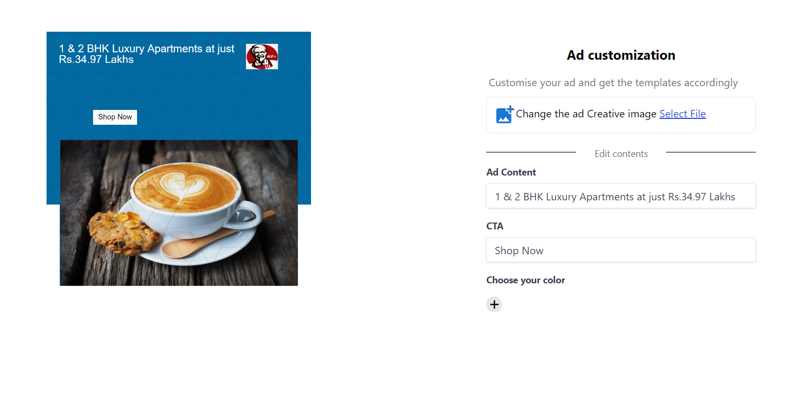
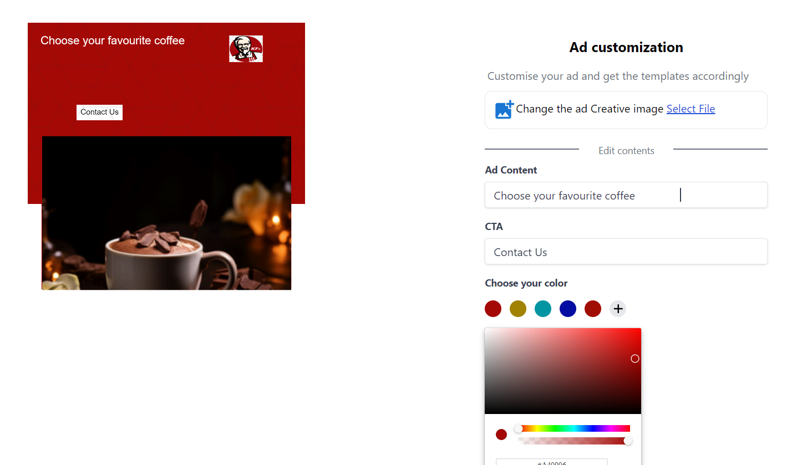
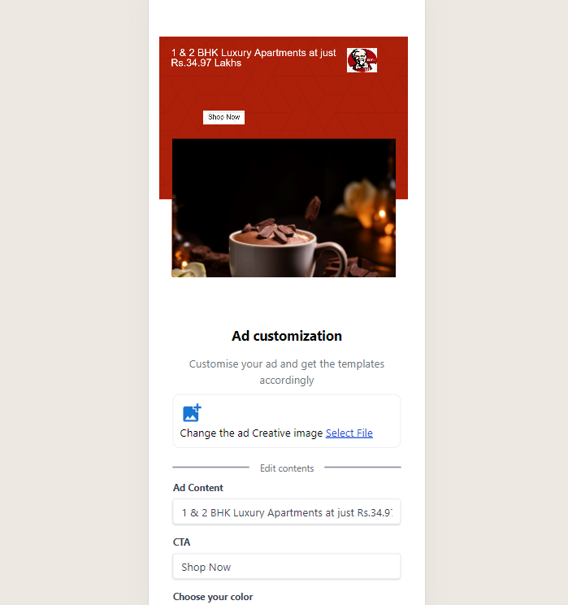

# Canva-Design

This is a customizable ad Canva component built using React. It allows users to customize the ad content, image, background color, and call-to-action (CTA) text.

## Features
- Customize ad content text
- Change ad image
- Choose background color
- Edit call-to-action (CTA) text
- Fully responsive design for all screen sizes

## Preview







## Tech Stack
- **React**: JavaScript library for building user interfaces.
- **Canva**: Design tool for creating graphics, presentations, posters, and other visual content.
- **Tailwind CSS**: Utility-first CSS framework for rapidly building custom designs.
- **React Color**: Component for picking colors in React.
- **React Font Awesome**: Font Awesome icons as React components.

## Usage
1. Clone the repository:

```bash
git clone https://github.com/Sonali020200/Canva-Design.git
```
2. Install dependencies:
```bash
cd Canva-Design

npm install
```
3. Run the development server:
```bash
npm start
```

## Live Link
https://canva-design-nine.vercel.app/
